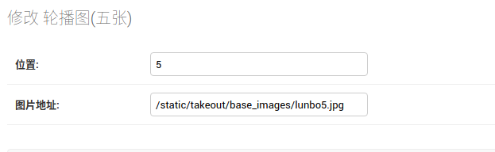
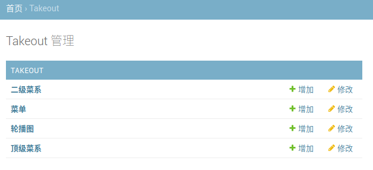
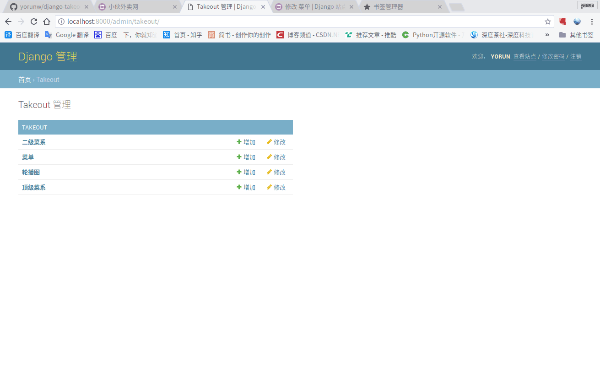
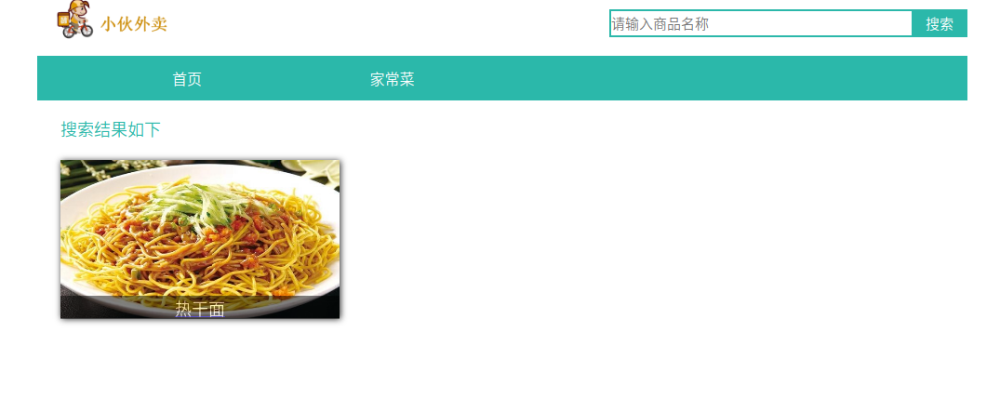
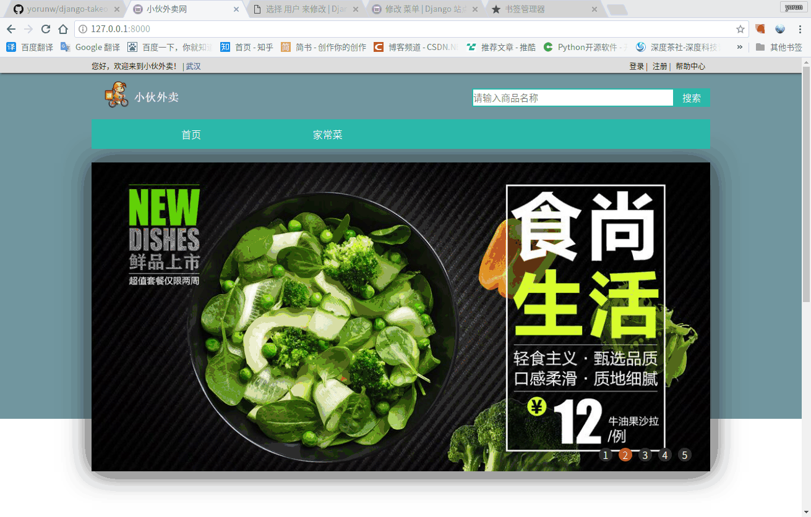
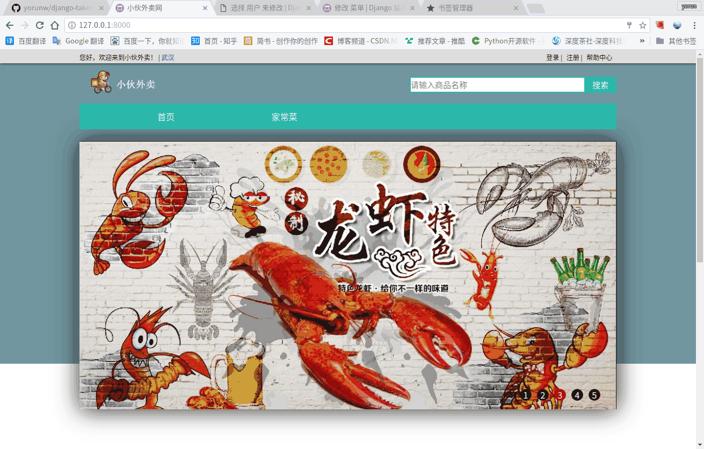
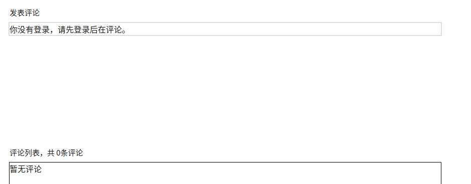
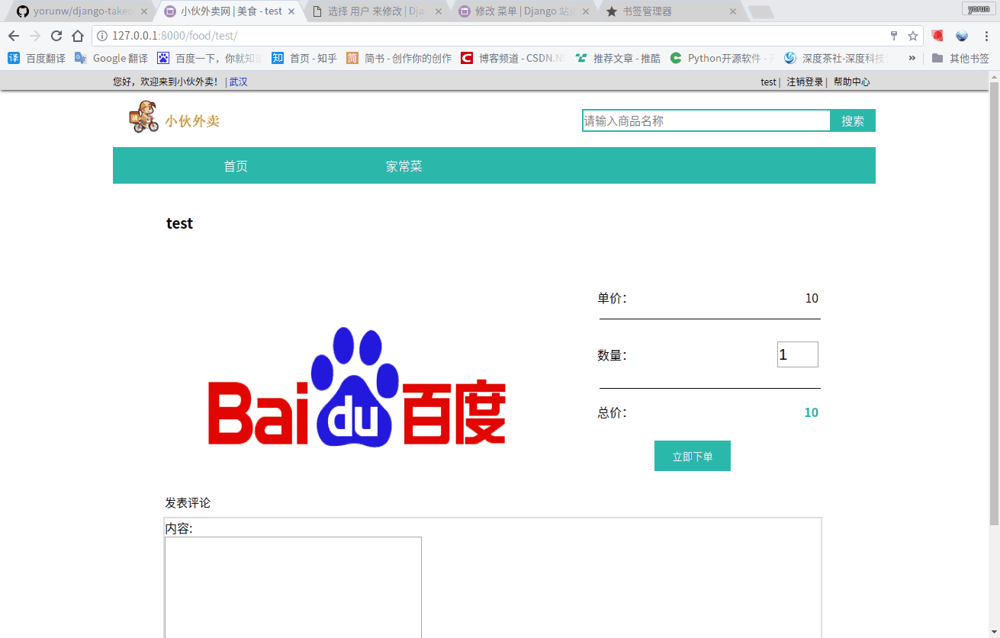

# django-takeout-xiaohuo
## 小伙外卖项目介绍
本项目仅用于学习，也是我学习django的笔记，还有一些内容等待完善。

## 1.运行环境
* Python 3.5+
* django 11.1

运行项目
```
python3 manage.py runserver
```
后台 `localhost/admin/`

## 2.数据库
默认使用sqlite3,若使用mysql需进行如下配置
```python
# xiaohuo/setting.py
# -表示删除 +表示增加
DATABASES = {
    'default': {
        -'ENGINE': 'django.db.backends.sqlite3',
        +'ENGINE': 'django.db.backends.mysql',
        -'NAME': os.path.join(BASE_DIR, 'db.sqlite3'),
        +'NAME': 'xiaohuo',
        +'USER': 'username',
        +'PASSWORD': 'password',
        +'HOST': 'localhost',
        +'PORT': '3306',
    }
}
```
所需依赖 mysqlclient,命令行执行

`pip install mysqlclient`

数据库迁移，在根目录下执行
```sudo
python3 manage.py makemigrations
python3 manage.py migrate
```
创建管理员账户
```
python3 manage.py createsuperuser
```
## 3.功能介绍
1. 添加轮播图 (限定五张)
--------


2. 添加顶级菜系、二级菜系、菜单




3. 搜索



4. 登录、注册




5. 评论



